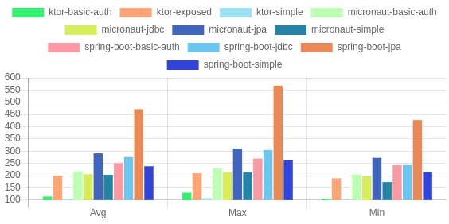

# Comparing Java Frameworks for Microservices

# [Dashboard](https://paslavsky.github.io/java-microservices/)

### Memory on start

### Working memory

### Uptime

### Warming up

### Request time

For more information see [documentation](./docs/index.md)